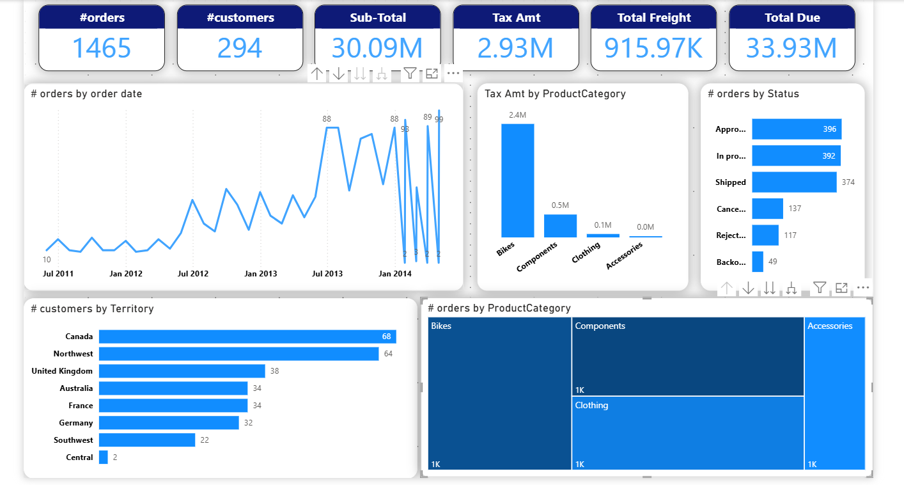

# Power BI Sales Analysis Dashboard

## Overview
This project is a sales analysis dashboard built using Power BI.

The dataset was modeled using a Star Schema design by separating the data into Fact and Dimension tables to improve performance and scalability.

## Data Modeling
- Fact Table:
  - Sales Orders

- Dimension Tables:
  - Customers
  - Products
  - Territories
  - Order Status

## Data Preparation
- Removed duplicates
- Cleaned unnecessary columns
- Optimized relationships
- Built fact and dimension tables

## Dashboard Features
- Total Orders
- Total Customers
- Total Sales
- Tax Amount Analysis
- Freight Analysis
- Orders by Status
- Customers by Territory
- Orders Over Time

## Tools Used
- Power BI
- Power Query
- DAX
- Excel

## Dashboard Preview

